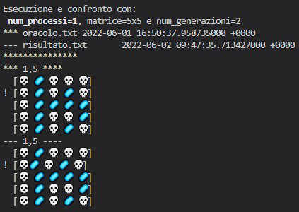
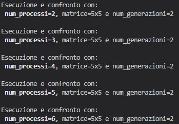
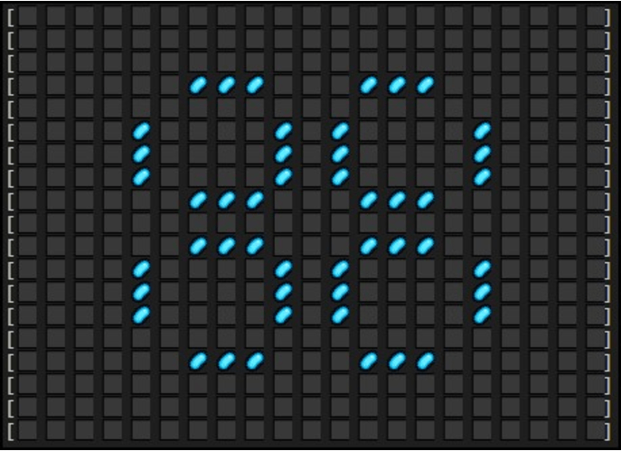

# Game of Life

## Project Info
Marrazzo Vincenzo: *0522501325*

Benchmark with Google Cloud: **6** *instances*, **4** *vCPU* and **16** GB memory (*e2-standard-4*)

# Indice
* [Introduzione](#conways-game-of-life)
* [Descrizione della soluzione](#descrizione-della-soluzione)
* [Funzioni principali](#funzioni-principali)
* [How to Run](#how-to-run)
* [Correctness](#correctness)
* [Benchmarks](#benchmarks)
* [Conclusioni](#conclusioni)
* [Curiosità](#curiosità)

# Conway's Game of Life


Il gioco della vita (*Game of Life*) è un automa cellulare sviluppato dal matematico inglese John Conway. Il suo scopo è quello di mostrare come comportamenti simili alla vita possano emergere da regole semplici e interazioni a molti corpi, principio che è alla base dell'ecobiologia, la quale si rifà anche alla [teoria della complessità](https://it.wikipedia.org/wiki/Teoria_della_complessit%C3%A0).\
Si tratta in realtà di un **gioco senza giocatori** poichè la sua evoluzione è determinata dal suo stato iniziale, senza necessità di alcun input da parte di giocatori umani. Si svolge su una griglia di caselle quadrate (celle) che si estende all'infinito in tutte le direzioni, tale griglia viene definita <code>mondo</code>. Ogni cella presenta al più 8 vicini, che sono le celle ad essa adiacenti, includendo quelle in senso diagonale. Ogni cella può trovarsi in due stati: "*ALIVE*" o "*DEAD*".\
Gli stati di tutte le celle in un dato istante sono usati per calcolare lo stato delle celle all'istante successivo, quindi tutte le celle del mondo vengono aggiornate simultaneamente nel passaggio da un istante a quello successivo: passa così una  <code>generazione</code>.\
Le transizioni dipendono dallo stato delle celle vicine in quella generazione:

+ Qualsiasi cella viva con meno di due celle vive adiacenti muore, come per effetto d'isolamento
+ Qualsiasi cella viva con due o tre celle vive adiacenti sopravvive alla generazione successiva
+ Qualsiasi cella viva con più di tre celle vive adiacenti muore, come per effetto di sovrappopolazione
+ Qualsiasi cella morta con esattamente tre celle vive adiacenti diventa una cella viva, come per effetto di riproduzione


# Descrizione della soluzione
Prima di iniziare la computazione vera e propria del gioco tutti i processi inizializzano alcune strutture necessarie per il corretto funzionamento del gioco. La matrice <code>matrix</code> rappresenta il mondo iniziale generato randomicamente, mentre la matrice <code>finalWorld</code> conterrà lo stato del mondo al termine di ogni generazione. Oltre a queste due variabili vi sono diversi array e altri tipi di dati utili per l’invio e la ricezione delle righe ai processi adiacenti.\

```C
int main(int argc, char* argv[]) {
    int my_rank;        
    int nprocs;         
    int tag = 10;       
    double start_time, end_time;
    MPI_Status status;  
    MPI_Request requestTop, requestBottom;

    MPI_Init(&argc, &argv);
    MPI_Comm_rank(MPI_COMM_WORLD, &my_rank);    
    MPI_Comm_size(MPI_COMM_WORLD, &nprocs);     
    srand(1);

    char *matrix; //Matrice generata

    /*Ottengo i parametri in input, necessari per creare la matrice ed il numero di generazioni*/
    int ROW_SIZE = atoi(argv[1]);       //Numero righe matrice
    int COL_SIZE = atoi(argv[2]);       //Numero colonne matrice
    int GENERATIONS = atoi(argv[3]);    //Numero generazioni

    // In ricezione dalla MPI_Scatterv
    char *matrixrec;
    int dimMatrixRec = 0;

    //Dati utili per la suddivisione in maniera equa (se possibile) della matrice
    int *counts;
    int *displacements;
    int *rowPerProcess;

    // Dati per la ricostruzione della matrice
    char *rebuildedMatrix;
    char *topRow, *bottomRow;

    // Dati finali
    char *newMiniWorld;        //Porzione di matrice aggiornata
    char *finalWorld;          //Matrice che conterrà tutte le porzioni di matrici aggiornate

    int root_rank = 0;
```

L'algoritmo può percorrere due strade: **strada sequenziale** e **strada parallela**.

## Strada sequenziale
A differenza della strada **parallela**, la strada sequenziale non effettua alcuna comunicazione proprio perché non ha bisogno di comunicare con nessun'altro processo.

Nella fase iniziale il processo Master si occupa di generare pseudo-casualmente la matrice iniziale per la prima generazione, con la funzione `generateMatrix()`: questa funzione, permette di generare appunto, in maniera pseudo-casuale, una matrice di char di dimensione N X M la quale conterrà come caratteri: 'a' (cella viva) 'd' (cella morta)

Successivamente grazie a `topRow` e `bottomRow`, che sono rispettivamente la prima e l'ultima riga della matrice `matrix`, si è in grado di ricostruire la matrice `rebuildedMatrix`.
> La funzione <code>rebuildMatrix()</code> non fa altro che fondere la matrice <code>matrix</code> con le righe estreme <code>topRow</code> e <code>bottomRow</code> concatenandole rispettivamente sopra e sotto alla matrice in questione.

In questo modo si può proseguire con la chiamata di <code>gameUpdate()</code> che permetterà l’aggiornamento della matrice usando le ghost cells (righe ricevute), ma non includendole nella computazione, altrimenti non otterremmo il risultato desiderato. L’aggiornamento permetterà di capire se una cella viva (a) potrà sopravvivere o morire a seguito di *under* oppure di *over* population mentre per una cella morta (d) permetterà di vedere se potrà riprodursi o meno.

```C
if (nprocs == 1) {
    matrix = (char *)malloc((ROW_SIZE * COL_SIZE) * sizeof(char));      
    topRow = malloc(sizeof(char) * COL_SIZE);                           
    bottomRow = malloc(sizeof(char) * COL_SIZE);                        
    rebuildedMatrix = malloc(sizeof(char) * (ROW_SIZE + 2) * COL_SIZE); //Alloco spazio per la matrice che verrà ricostruita, aggiungendo semplicemente "+ 2" per le due righe nuove
    finalWorld = malloc(sizeof(char) * (ROW_SIZE * COL_SIZE));

    generateMatrix(matrix, ROW_SIZE, COL_SIZE);

    start_time = MPI_Wtime();

    for (int curr_generation=0; curr_generation<GENERATIONS; curr_generation++) {
        memcpy(topRow, &matrix[0], COL_SIZE * sizeof(char));
        memcpy(bottomRow, &matrix[(ROW_SIZE - 1) * COL_SIZE], COL_SIZE * sizeof(char));

        //Ricostruisco la matrice
        rebuildMatrix(matrix, ROW_SIZE, bottomRow, topRow, rebuildedMatrix, COL_SIZE);

        //Aggiorno la matrice
        gameUpdate(rebuildedMatrix, finalWorld, ROW_SIZE, my_rank, COL_SIZE);

        //Aggiorno matrix affinché venga utilizzata la matrice aggiornata nella generazione successiva
        matrix = finalWorld;
    }
}
```

## Strada parallela

Per la distribuzione del lavoro per ogni processo si è deciso di suddividere la matrice per righe, così da inviare ad ogni processo, incluso il <code>Master</code> (processo 0), una porzione della matrice iniziale che verranno letti da posizioni contigue di memoria.\
Inoltre in modo di evitare che il programma si blocchi quando il numero di processi supera il numero di righe si è creato un nuovo comunicator con solo i processi necessari alla computazione del gioco. Abbiamo, quindi, a disposizione due gruppi <code>world_group</code> e <code>new_group</code>:

* <code>world_group</code>: contiene il gruppo di processi del comunicator <code>MPI_COMM_WORLD</code>.
* <code>new_group</code>: contiene solo i processi necessari alla computazione.

Se il numero di processi supera il numero di righe allora verrà creato il comunicator <code>new_comm</code> con numero massimo di processi uguale al numero di righe e quindi utilizzerà il gruppo <code>new_group</code>, altrimenti verrà creato il comunicator <code>new_comm</code> con numero di processi uguale a quelli dati in input.

```C
else {
    //Controllo se il numero di processi è maggiore del numero delle righe
    MPI_Group world_group;  
    MPI_Comm_group(MPI_COMM_WORLD, &world_group);
    MPI_Group new_group;    
    MPI_Comm new_comm;      
    if (nprocs > ROW_SIZE) {
        int ranks_needed = nprocs > ROW_SIZE ? ROW_SIZE : nprocs;
        int ranks[ranks_needed];
        for (int i = 0; i < ranks_needed; i++) {
            ranks[i] = i;
        }
        MPI_Group_incl(world_group, ranks_needed, ranks, &new_group);
        MPI_Comm_create(MPI_COMM_WORLD, new_group, &new_comm);
    } else {
        MPI_Comm_create(MPI_COMM_WORLD, world_group, &new_comm);
    }

    //Elimino i processi non necessari
    if (new_comm == MPI_COMM_NULL) {
        MPI_Finalize();
        return 0;
    }

    MPI_Comm_rank(new_comm, &my_rank);
    MPI_Comm_size(new_comm, &nprocs);
```

Successivamente, vengono calcolati il resto (<code>remainder</code>) e il risultato della divisione (<code>count</code>) in modo da poter assegnare correttamente le porzioni di righe della matrice ai processi, così ogni processo può lavorare sulla propria *porzione di matrice*.\
Nel caso in cui la divisione abbia resto diverso da 0, si assegnerà una riga in più ai processi con <code>my_rank</code> < <code>remainder</code> altrimenti si riuscirà ad assegnare equamente a tutti lo stesso numero di righe. Inoltre, viene allocato spazio per diversi tipi di dati come <code>counts, displacements e rowPerProcess</code> che contengono rispettivamente il numero di elementi per ogni processi, i displacements tra ogni processo e il numero di righe di ogni processo, i quali verranno calcolati tramite la funzione <code>initDisplacementPerProcess()</code>.

> Viene allocato spazio anche per tipi di dati che permetteranno l'invio delle righe ai processi adiacenti e la ricostruzione della porzione di matrice:
> * <code>matrixrec</code>: porzione di matrice ricevuto ed è ancora da computare
> * <code>topRow</code>: riga ottenuta dal processo adiacente precedente
> * <code>bottomRow</code>: riga ottenuta dal processo adiacente successivo
> * <code>rebuildedMatrix</code>: matrice ricostruita, aggiungendo alla matrice <code>matrixrec</code> le righe ottenute dai processi adiacenti, cioè <code>topRow</code> e <code>bottomRow</code>.
> <br></br>
> * <code>newMiniWorld</code>: risultato della porzione di matrice dopo essere computata dalla funzione <code>gameUpdate()</code>

```C
    //Controllo chi è il processo precedente e successivo
    int next = (my_rank + 1) % nprocs;           
    int prev = (my_rank + nprocs - 1) % nprocs;  

    //Dati utili per la suddivisione in maniera equa (se possibile) della matrice
    int count = ROW_SIZE / nprocs;
    int remainder = ROW_SIZE % nprocs;
    int rows;

    counts = malloc(nprocs * sizeof(int));         //Array che conterrà il num. di elementi di ogni processo
    displacements = malloc(nprocs * sizeof(int));  //Array che conterrà i displacements per ogni processo
    rowPerProcess = malloc(nprocs * sizeof(int));  //Array che conterrà il numero di righe per ogni processo

    /* ------------ START ------------*/
    //Chiamata funzione di inizializzazione per displacement e send_counts per i processi
    initDisplacementPerProcess(counts, displacements, rowPerProcess, nprocs, remainder, count, COL_SIZE);

    matrixrec = malloc(sizeof(char) * (rowPerProcess[my_rank] * COL_SIZE));     //Alloco spazio per la matrice in ricezione
    dimMatrixRec = rowPerProcess[my_rank] * COL_SIZE;                           //Calcolo dimensione della matrice in ricezione

    //Inizializzazione delle variabili necessarie per l'invio delle righe ai processi adiacenti
    newMiniWorld = malloc(sizeof(char) * (rowPerProcess[my_rank]) * COL_SIZE);   
    rows = rowPerProcess[my_rank];                //N. di righe della porzione di array ricevuta
    topRow = malloc(sizeof(char) * COL_SIZE);           
    bottomRow = malloc(sizeof(char) * COL_SIZE);        

    rebuildedMatrix = malloc(sizeof(char) * (rowPerProcess[my_rank] + 2) * COL_SIZE);  //Alloco spazio per la matrice che verrà ricostruita, aggiungendo semplicemente "+ 2" per le due righe nuove (ottenute dai processi adiacenti)
```

La fase iniziale del codice termina con il processo <code>Master</code> che si occupa di generare pseudo-casualmente la matrice iniziale per la prima generazione, con la funzione <code>generateMatrix()</code>: questa funzione, permette di generare appunto, in maniera pseudo-casuale, una matrice di char di dimensione N X M la quale conterrà come caratteri: 'a' (cella viva) 'd' (cella morta).

```C
    if(my_rank == root_rank) { //* MASTER
        //Generazione iniziale e stampa della matrice
        matrix = (char *)malloc((ROW_SIZE * COL_SIZE) * sizeof(char));
        generateMatrix(matrix, ROW_SIZE, COL_SIZE);
        finalWorld = malloc(sizeof(char) * (ROW_SIZE * COL_SIZE));
    }
    else { //SLAVE
        /*VUOTO*/
    }

    start_time = MPI_Wtime();
```

Una volta completata tutta questa fase d'inizializzazione dei dati, prima del <code>for</code>, viene fatta una <code>MPI_Scatterv()</code> la quale permetterà l’invio della porzione di matrice ad ogni processo; queste righe verranno contenute in <code>matrixrec</code>.\
Una volta ricevuta la propria porzione di matrice viene svolto un ciclo <code>for</code> dove i processi inizieranno a comunicare con i processi adiacenti per l’invio delle proprie righe estreme (<code>topRow</code> e <code>bottomRow</code>) da inviare rispettivamente al processo precedente (<code>prev</code>) e al successivo (<code>next</code>) in maniera non bloccante tramite la <code>MPI_Send()</code>.

Durante l'invio delle righe estreme inizio a "ricostruire" una nuova matrice `rebuildedMatrix`, per il processo corrente, inserendo solamente il corpo centrale cioè `matrixrec`, tramite la funzione `rebuildMatrix2()`.

Una volta che un processo ha ricevuto le righe estreme, attraverso la funzione <code>rebuildMatrix2()</code>, concateno le due righe alla matrice `rebuildedMatrix`.

> La funzione <code>rebuildMatrix2()</code> ingloba due funzionalità ed in base al valore del parametro esplicito `edge_or_center` scelgo una delle due:
> * Se `edge_or_center`=**1** : verrà ricostruita la matrice inserendo solamente il corpo centrale.
> * Se `edge_or_center`=**0** : verrà ricostruita la matrice concatenando ai bordi le righe estreme. \

In questo modo si può proseguire con la chiamata di <code>gameUpdate()</code> che permetterà l’aggiornamento della porzione di matrice contenuta dal processo, usando le ghost cells (righe ricevute), ma non includendole nella computazione, altrimenti non otterremmo il risultato desiderato. L’aggiornamento permetterà di capire se una cella viva (a) potrà sopravvivere o morire a seguito di *under* oppure di *over* population mentre per una cella morta (d) permetterà di vedere se potrà riprodursi o meno.

```C
    //Invio e ricezione della porzione di matrice ad ogni processo
    MPI_Scatterv(matrix, counts, displacements, MPI_CHAR, matrixrec, dimMatrixRec, MPI_CHAR, root_rank, new_comm);

    for (int curr_generation=0; curr_generation<GENERATIONS; curr_generation++) {
        MPI_Isend(&matrixrec[0], COL_SIZE, MPI_CHAR, prev, tag, new_comm, &requestTop);    //Invio la riga al mio prev

        MPI_Isend(&matrixrec[(rows - 1) * COL_SIZE], COL_SIZE, MPI_CHAR, next, tag, new_comm, &requestBottom); //Invio la riga al mio next

        //Nel frattempo inizio a ricostruire la matrice inserendo quella centrale
        rebuildMatrix2(matrixrec, 1, rows, NULL, NULL, rebuildedMatrix, COL_SIZE);

        //Ricevo le righe dai processi adiacenti
        MPI_Recv(bottomRow, COL_SIZE, MPI_CHAR, prev, tag, new_comm, &status); //Ricevo la riga dal mio prev

        MPI_Recv(topRow, COL_SIZE, MPI_CHAR, next, tag, new_comm, &status);    //Ricevo la riga dal mio next

        //Ricostruisco la sottomatrice del processo aggiungendo le 2 righe ottenute dai processi adiacenti
        if (prev == next) {
            //Se ho due processi, next e prev coincidono quindi devo scambiare "topRow" con "bottomRow"
            rebuildMatrix2(NULL, 0, rows, topRow, bottomRow, rebuildedMatrix, COL_SIZE);
        }
        else {
            //Se ho più di due processi NON devo invertire "topRow" con "bottomRow"
            rebuildMatrix2(NULL, 0, rows, bottomRow, topRow, rebuildedMatrix, COL_SIZE);
        }

        //Chiamo la funzione principale "gameUpdate" per aggiornare le matrici (e quindi sto aggiornando il gioco)
        gameUpdate(rebuildedMatrix, newMiniWorld, rows, my_rank, COL_SIZE);

        //Adesso aggiorno matrixrec affinché venga utilizzata la porzione aggiornata della matrice nella generazione successiva
        matrixrec = newMiniWorld;
    }

    //Restituisco la matrice finale contenuta in finalWorld al master per la stampa
    MPI_Gatherv(newMiniWorld, counts[my_rank], MPI_CHAR, finalWorld, counts, displacements, MPI_CHAR, root_rank, new_comm);
}

end_time = MPI_Wtime();
/*-------------FINE-------------*/
```

Al termine di questa fase, la porzione di matrice aggiornata sarà contenuta nella matrice <code>newMiniWorld</code>, dopo di ché la matrice <code>newMiniWorld</code> verrà assegnata a <code>matrixRec</code> cosicché il ciclo <code>for</code> possa continuare con la computazione delle generazioni successive.\
Al di fuori del `for` viene effettuata una <code>MPI_Gatherv()</code> dove ogni processo invia la propria porzione di matrice aggiornata allo scopo di ottenere l'ultima generazione della matrice di partenza <code>matrix</code>, cioè <code>finalWorld</code>.

# Funzioni principali
In questa sezione verranno descritte in dettagli le funzioni principali del programma

## gameUpdate
La funzione <code>gameUpdate()</code> rappresenta il core del programma. Viene chiamata da ogni processo per aggiornare la propria porzione di matrice.

```C
void gameUpdate(char *rebuildedMatrix, char *newMiniWorld, int numbersOfRows, int rank, int COL_SIZE) {
    int offset_row_start = 1;                //Indica da dove deve partire la computazione per evitare di computare anche le ghost cells
    int offset_row_end = numbersOfRows + 1;  //Indica il punto dove deve finire la computazione evitando le ghost cells

    for (int i = offset_row_start; i < offset_row_end; i++) {
        for (int j = 0; j < COL_SIZE; j++) {
            //Se la cella è viva, allora controllo se deve morire o sopravvivere alla generazione successiva
            if (rebuildedMatrix[j + (i * COL_SIZE)] == ALIVE) {
                //sottraendo offset_row_start ad i ottengo la posizione corretta di dove inserire nel newMiniWorld
                newMiniWorld[j + ((i - offset_row_start) * COL_SIZE)] = checkUnderAndOverPopulation(rebuildedMatrix, i, j, offset_row_end + 1, COL_SIZE, COL_SIZE);
                //Se la cella è morta allora controllo se deve riprodursi
            } else if (rebuildedMatrix[j + (i * COL_SIZE)] == DEAD) {
                //sottraendo offset_row_start ad i ottengo la posizione corretta di dove inserire nel newMiniWorld
                newMiniWorld[j + ((i - offset_row_start) * COL_SIZE)] = checkReproduction(rebuildedMatrix, i, j, offset_row_end + 1, COL_SIZE, COL_SIZE);
            }
        }
    }
}
```
Le seguenti due funzioni: <code>checkReproduction()</code> e <code>checkUnderAndOverPopulation()</code> sono quelle che verranno chiamate dalla funzione <code>gameUpdate()</code> per effettuare le modifiche necessarie che prevede il gioco.

## checkReproduction
La funzione `checkReproduction()` viene chiamata se la cella è **morta** e serve per scoprire se la cella può riprodursi o rimanere morta per la  generazione successiva.

```C
char checkReproduction(char *matrixrec, int currentRow, int currentColumn, int numbersOfRows, int numbersOfCols, int COL_SIZE) {
    int viciniVivi = 0;

    //Se la riga ha un indice maggiore di 0 ha sicuramente un vicino sopra di lei
    if (currentRow > 0) {
        viciniVivi = (matrixrec[((currentRow - 1) * COL_SIZE) + (currentColumn)]) == ALIVE ? viciniVivi + 1 : viciniVivi;
        //Se la colonna ha un indice maggiore di 0 sicuramente ha un vicino sinistro
        if (currentColumn > 0)
            viciniVivi = (matrixrec[((currentRow - 1) * COL_SIZE) + (currentColumn - 1)]) == ALIVE ? viciniVivi + 1 : viciniVivi;
        //Se la colonna non è l'ultima ha sicuramente un vicino destro, Right neigh
        if (currentColumn < numbersOfCols - 1)
            viciniVivi = (matrixrec[((currentRow - 1) * COL_SIZE) + (currentColumn + 1)]) == ALIVE ? viciniVivi + 1 : viciniVivi;
    }
    //Se la riga è minore del numero di righe-1, vuol dire che non è l'ultima ed ha un vicino sotto di lei
    if (currentRow < numbersOfRows - 1) {
        viciniVivi = (matrixrec[((currentRow + 1) * COL_SIZE) + (currentColumn)]) == ALIVE ? viciniVivi + 1 : viciniVivi;
        //Se la colonna ha un indice maggiore di 0 sicuramente ha un vicino sinistro
        if (currentColumn > 0)
            viciniVivi = (matrixrec[((currentRow + 1) * COL_SIZE) + (currentColumn - 1)]) == ALIVE ? viciniVivi + 1 : viciniVivi;
        //Se la colonna non è l'ultima ha sicuramente un vicino destro
        if (currentColumn < numbersOfCols - 1)
            viciniVivi = (matrixrec[((currentRow + 1) * COL_SIZE) + (currentColumn + 1)]) == ALIVE ? viciniVivi + 1 : viciniVivi;
    }
    //Se non sono presenti vicini top o bottom, controlliamo right or left

    //Controllo vicino sinistro
    if (currentColumn > 0)
        viciniVivi = (matrixrec[((currentRow)*COL_SIZE) + (currentColumn - 1)]) == ALIVE ? viciniVivi + 1 : viciniVivi;
    //Controllo vicino destro
    if (currentColumn < numbersOfCols - 1)
        viciniVivi = (matrixrec[((currentRow)*COL_SIZE) + (currentColumn + 1)]) == ALIVE ? viciniVivi + 1 : viciniVivi;

    //Se il numero di viciniVivi è esattamente 3 la cella si riproduce altrimenti resta morta
    return (viciniVivi == 3) ? ALIVE : DEAD;
}
```

## checkUnderAndOverPopulation
La funzione `checkUnderAndOverPopulation()` viene chiamata se la cella è **viva** e serve per scoprire se la cella deve morire per *under* o *over* population.

```C
char checkUnderAndOverPopulation(char *matrixrec, int currentRow, int currentColumn, int numbersOfRows, int numbersOfCols, int COL_SIZE) {
    int viciniVivi = 0;

    //Se la riga ha un indice maggiore di 0 ha sicuramente un vicino sopra di lei
    if (currentRow > 0) {
        viciniVivi = (matrixrec[((currentRow - 1) * COL_SIZE) + (currentColumn)] == ALIVE) ? viciniVivi + 1 : viciniVivi;
        //Ho il vicino sinistro
        if (currentColumn > 0)
            viciniVivi = (matrixrec[((currentRow - 1) * COL_SIZE) + (currentColumn - 1)] == ALIVE) ? viciniVivi + 1 : viciniVivi;
        //Ho il vicino destro
        if (currentColumn < numbersOfCols - 1)
            viciniVivi = (matrixrec[((currentRow - 1) * COL_SIZE) + (currentColumn + 1)] == ALIVE) ? viciniVivi + 1 : viciniVivi;
    }
    //Se la riga è minore del numero di righe-1, vuol dire che non è l'ultima ed ha un vicino sotto di lei
    if (currentRow < numbersOfRows - 1) {
        viciniVivi = (matrixrec[((currentRow + 1) * COL_SIZE) + (currentColumn)] == ALIVE) ? viciniVivi + 1 : viciniVivi;
        //Se la colonna ha un indice maggiore di 0 sicuramente ha un vicino sinistro
        if (currentColumn > 0)
            viciniVivi = (matrixrec[((currentRow + 1) * COL_SIZE) + (currentColumn - 1)] == ALIVE) ? viciniVivi + 1 : viciniVivi;
        //Se la colonna non è l'ultima ha sicuramente un vicino destro
        if (currentColumn < numbersOfCols - 1)
            viciniVivi = (matrixrec[((currentRow + 1) * COL_SIZE) + (currentColumn + 1)] == ALIVE) ? viciniVivi + 1 : viciniVivi;
    }
    //Se non sono presenti vicini top o bottom, controlliamo right or left

    //Controllo vicino sinistro
    if (currentColumn > 0)
        viciniVivi = (matrixrec[((currentRow)*COL_SIZE) + (currentColumn - 1)] == ALIVE) ? viciniVivi + 1 : viciniVivi;
    //Controllo vicino destro
    if (currentColumn < numbersOfCols - 1)
        viciniVivi = (matrixrec[((currentRow)*COL_SIZE) + (currentColumn + 1)] == ALIVE) ? viciniVivi + 1 : viciniVivi;

    //OverPopulation or UnderPopulation
    return (viciniVivi > 3 || viciniVivi < 2) ? DEAD : ALIVE;
}
```

# How to run
```bash
mpicc GameOfLife_finale.c -o fin
```

mpirun --allow-run-as-root -np `{VCPUs}` fin `{Numero righe}` `{Numero colonne}` `{Generazioni}`

```bash
mpirun --allow-run-as-root -np 2 fin 5 5 2
```

# Correctness
La dimostrazione della correttezza viene proposta attraverso l'esecuzione del file *correctness.sh*, digitando il seguente comando:

```bash
source correctness.sh
```

Abbiamo bisogno di 3 file per dimostrare ciò:
1. **oracolo.txt**, un file contenente la matrice che dovrebbe fornire in output il caso di test
2. **GameOfLife_corr.c**, versione leggermente modificata del file *GameOfLife_finale.c* che come novità ha la scrittura della matrice finale in un file di testo soprannominato `risultato.txt`
3. **risultato.txt**, file generato dall'esecuzione di `GameOfLife_corr.c` e contiene la matrice finale del caso di test.

Lo scopo di questa parte del progetto è assicurarsi che l'output fornito eseguendo il codice per *n* VCPUs

```bash
esempio: mpirun --allow-run-as-root -np {VCPUs} fin 5 5 2
```

combaci con l'oracolo, così da dimostrare che qualsiasi sia il numero di processi con la quale viene eseguito il codice `GameOfLife_finale.c` l'output risulta quello desiderato.

Il file *correctness.sh* non fa altro che eseguire *GameOfLife_corr.c* per un certo numero di volte (9 volte) e dopo ogni esecuzione viene eseguito il seguente comando:

```bash
diff -c oracolo.txt risultato.txt
```
per verificare che il caso di test abbia dato l'output desiderato, definito all'interno dell'oracolo.

I possibili output che può fornire il comando sono:

1. Nel caso in cui i due file, *oracolo.txt* e *risultato.txt*, **non siano identici** viene indicata con il simbolo "!" la riga che presenta incongruenze:

    

2. Altrimenti, se risultano **identici**, l'esecuzione continua senza mostrare alcun tipo di output:

    

# Benchmarks
I test per valutare le prestazioni dell'algoritmo sono stati effettuati su un cluster AWS composto da 6 istanze di tipo e2-standard-4. Inoltre, per valutare i test verranno considerati la <code>scalabilità forte</code>, <code>scalabilità debole</code> e lo <code>speed-up</code> andando poi a valutare l'efficienza delle varie esecuzioni con diverso numero di processori.

> * **T1**: tempo d'esecuzione su un singolo processore
> * **Tp**: tempo d'esecuzione dell'algoritmo con *p* processori
> * **P**: numero di processori


## Strong Scalability

La scalabilità forte indica l'accelerazione per una dimensione del problema fissa,infatti è stata testata eseguendo il codice con un differente numero di processori (VCPUs) su una matrice di dimensioni costanti, effettuando diverse rilevazioni di tempo andando poi a calcolare un tempo medio per ogni esecuzione con i diversi processori.
<br>
> **L'efficienza** della Strong Scalability è stata calcolata tramite la seguente formula: <code>Ep = (T1/(P*Tp))*100%</code> oppure più semplicemente <code>Ep = Sp/P</code>.

## Weak Scalability
La scalabilità debole indica l'accelerazione per una dimensione variabile del problema al variare del numero di core ed è stata misurata eseguendo il codice con un differente numero di VCPUs e aumentando di 1000 ogni volta il numero di righe per ogni core, tenendo costante il numero di colonne. Anche qui sono state effettuate diverse rilevazioni calcolando poi la media per ogni esecuzione con i diversi processori.

> **L'efficienza** della Weak Scalability è stata calcolata tramite la seguente formula: <code>Ep = (T1/Tp)*100%</code>.

## Speed-up
Lo speed-up misura la riduzione del tempo di  esecuzione dell’algoritmo eseguito su p processori rispetto all’esecuzione su 1 processore. Lo speed-up in generale è minore del numero di processori mentre lo speed-up ideale assume proprio valore p. Quindi un esecuzione su 2 processori presenta uno speed-up ideale di 2 e cosi via.

> Lo **speed-up** per la Strong Scalability è stato calcolato mediante la seguente formula: <code>Sp = T1/Tp</code>.

# Test 1
#### Rows=1000 Columns=1000 Generation=100

<div align="center" >

| VCPUs | Time (s) |
| ----- | ---- |
| 1 | 3,46646 |
| 2 | 1,77265 |
| 4 | 1,4207 |
| 6 | 0,95956 |
| 8 | 0,72575 |
| 10 | 0,58334 |
| 12 | 0,49355 |
| 14 | 0,42813 |
| 16 | 0,37864 |
| 18 | 0,3452 |
| 20 | 0,30798 |
| 22 | 0,28477 |
| 24 | 0,2648 |

</div>

<div align="center" style="text-align-last:center">

| VCPUs | 2 | 4 | 6 | 8 | 10 | 12 | 14 | 16 | 18 | 20 | 22 | 24 |
| ------- | - | - | - | - | -- | -- | -- | -- | -- | -- | -- | -- |
| Speed-up | 1,96 | 2,44 | 3,61 | 4,78 | 5,94 | 7,02 | 8,10 | 9,16 | 10,04 | 11,26 |12,17 | 13,09 |
| Efficienza | 97,78% | 61,00% | 60,21% | 59,70% | 59,42% | 58,53% | 57,83% | 57,22% | 55,79% | 56,28% | 55,33% | 54,55% |

</div>

| %20%5BSTRONG%20SCALABILITY%2C%201000x1000%20G%3D100%5D.png) |  |
| ---------------------------------------------------------------------------------------------------------------- | --------------------|

## Risultati
Come si può notare dalle tabelle riassuntive e dai grafici, lo speed-up su 2 processori è il "più vicino" allo speed-up ideale. Quindi l'algoritmo parallelo su **due processori** è quello più veloce in rapporto alle risorse utilizzate.

Questo lo si nota ancora di più nel grafico "Speed-up, **1000x1000 G=100**" che evidenzia il rapporto tra l'*Ideal Speed-up* (Speed-up ideale) e lo *Speed-up* (Speed-up medio rilevato sul cluster) il quale rappresenta l'*efficienza* e quindi una misura dello sfruttamento delle risorse di calcolo. Infatti, all'aumentare del numero di processori lo Speed-up si allontana sempre di più da quello ideale comportando, quindi, una perdita d'efficienza.

Lo sfruttamento del parallelismo del calcolatore da parte dell'algoritmo dimininuisce nonostante aumenti il numero di processori a disposizione.

# Test 2
#### Rows=6000 Columns=6000 Generations=100

<div align="center" >

| VCPUs | Time (s) |
| ----- | ---- |
| 1 | 124,57345 |
| 2 | 63,99145 |
| 4 | 50,79878 |
| 6 | 34,40241 |
| 8 | 26,29697 |
| 10 | 20,57419 |
| 12 | 17,04734 |
| 14 | 14,80177 |
| 16 | 12,95362 |
| 18 | 11,49264 |
| 20 | 10,38522 |
| 22 | 9,53589 |
| 24 | 8,68111 |

</div>

<div align="center" style="text-align-last:center">

| VCPUs | 2 | 4 | 6 | 8 | 10 | 12 | 14 | 16 | 18 | 20 | 22 | 24 |
| ------- | - | - | - | - | -- | -- | -- | -- | -- | -- | -- | -- |
| Speed-up | 1,95 | 2,45 | 3,62 | 4,74 | 6,05 | 7,31 | 8,42 | 9,62 | 10,84 | 12,00 |13,06 | 14,35 |
| Efficienza | 97,34% | 61,31% | 60,35% | 59,21% | 60,55% | 60,90% | 60,12% | 60,11% | 60,22% | 59,98% | 59,38% | 59,79% |

</div>

| %20%5BSTRONG%20SCALABILITY%2C%206000x6000%20G%3D100%5D.png) |  |
| ---------------------------------------------------------------------------------------------------------------- | --------------------|

## Risultati
Come si può notare dalle tabelle riassuntive e dai grafici, lo speed-up su 2 processori è il "più vicino" allo speed-up ideale. Quindi l'algoritmo parallelo su **due processori** è quello più veloce in rapporto alle risorse utilizzate.

In questo test case si ricalca ancora di più il fatto che lo sfruttamento del parallelismo dimininuisce nonostante aumenti il numero di processori, anche perché la comunicazione su macchine diverse, dopo 4 VCPUs, è più dispendiosa rispetto ad una comunicazione sulla stessa macchina.

# Weak Scalability
Il seguente grafico riporta il test della <code>Weak Scalability</code> il quale è stato fatto aggiungendo un numero di righe pari a 1000 ogni volta che vi è un nuovo processore.

<div align="center" style="text-align-last:center">

| VCPUs | 2 | 4 | 6 | 8 | 10 | 12 | 14 | 16 | 18 | 20 | 22 | 24 |
| ------- | - | - | - | - | -- | -- | -- | -- | -- | -- | -- | -- |
| Efficienza | 96,69% | 61,43% | 60,78% | 61,00% | 58,93% | 60,34% | 60,38% | 60,66% | 60,32% | 60,18% | 60,16% | 59,41% |

</div>

<div align="center">

%20%5BWEAK%20SCALABILITY%2C%201000x1000%20G%3D100%5D.png)

</div>

# Conclusioni
Per concludere, l'algoritmo sfrutta sicuramente i vantaggi della parallelizzazione, ma non appieno. La comunicazione delle righe estreme ("ghost cell") ai processi adiacenti, nonostante avvenga in maniera non bloccante, comporta comunque un notevole calo delle prestazioni.\
Risulterebbe più efficiente effettuare un ulteriore controllo sull'avvenuta ricezione delle righe estreme, in maniera tale da continuare a ricostruire la matrice concatenando la riga estrema ricevuta prima (invece nella soluzione proposta si attende sempre che arrivi prima la riga estrema inviata dal processo precedente). Nonostante tutto, l'utilizzo di tali procedure non bloccanti ha permesso di ottenere comunque discreti risultati.

## Curiosità
Conway originariamente ipotizzò che nessun modello potesse crescere indefinitamente, cioè che per qualsiasi configurazione iniziale con un numero finito di cellule viventi, la popolazione non può crescere oltre un limite superiore finito. Alla pubblicazione del gioco in "Mathematical Games", Conway offrì un premio di cinquanta dollari (chiaramente una provocazione) alla prima persona che avrebbe potuto provare o smentire la congettura prima della fine del 1970. Il premio è stato vinto a novembre da un team del Massachusetts Institute of Technology, guidato da [Bill Gosper](https://en.wikipedia.org/wiki/Bill_Gosper); il "Cannone aliante Gosper" produce il suo primo aliante sulla 15a generazione e da quel momento in poi un altro aliante ogni 30a generazione.\
Per molti anni, questo cannone da aliante è stato il più piccolo che si conosca.

### GameOfLife_curiosity.c
Attraverso il codice *GameOfLife_curiosity.c* è stato simulato il **Cannone aliante Gosper**. *GameOfLife_curiosity.c* ha come base il codice *GameOfLife_finale.c*, ma aggiunge una leggera modifica: è stata introdotta la funzione `generateStaticMatrix()` che non fa altro che instanziare la matrice iniziale.

* How to run
```bash
mpicc GameOfLife_curiosity.c -o curiosity
```

mpirun --allow-run-as-root -np `{VCPUs}` curiosity `{choice}` `{GENERAZIONI}` |& grep -v "Read -1"

il campo `{choice}` può assumere due valori:

* **1**: verrà simulata la *Pistola aliante Gosper*
* **2**: verrà simulato *Pulsar*

```bash
mpirun --allow-run-as-root -np 2 curiosity 1 10 |& grep -v "Read -1"
```

Attraverso gli screen delle matrici di ogni generazione sono state create le seguenti gif:

### Pistola aliante Gosper
.gif)

### Pulsar
<div align="center">
    
</div>
